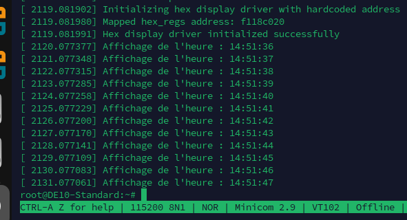

# 2425_ESE_LinuxEmbarqué_Weidle_Thomasset_Fricot

## TP1

### Prise en main

#### Connection au système

>[!Note]
>Pour démarrer, nous avons installé Linux sur la carte SD de la carte pour pouvoir utiliser Linux sur notre carte.
>Une fois connecté au SOC, nous avons observé la séquence de démarrrage.
>On peut remarquer en utilisant la commande **df -h** que la mémoire de la carte n'est pas complétement utilisée. Sur les 3Go de disponible seulement 1.3Go sont utilisés.

 

>[!Note]
>Nous avons ensuite augmenté la taille du système de fichier à l'aide la commande **./resize2fs_once**.

 
 

#### Configuration réseau
>[!Note]
>A l'aide de la commande **ifconfig** nous avons pu vérifier que la carte disposait d'une adresse IP. Sur la figure ci-dessous on peut voir que la carte n'est pas connectée et n'a donc pas d'adresse IP.

 
 

>[!Note]
>Après avoir connecté la carte, on peut voir sur la figure ci-dessous que la carte dispose bien d'une adresse IP.

 
 

>[!Note]
>Après s'être connecté au wifi **Techtinkerers** qui est le même réseau que le câble ethernet, on ping la carte pour vérifier que l'on arrive bien à se connecter. 

 
 

#### Découverte de la cible

>[!Note]
>On utilise les commandes **cat, less et more** pour voir le contenu des fichiers.
>- La commande **"cat"** affiche entièrement le contenu du fichier dans le terminal. 
>- La commande **"less"** permet d'afficher le contenu d'un fichier de manière intéractive.
>- La commande **"more"** permet d'afficher le contenu d'un fichier une page à la fois.

Dans la figure ci-dessous, on affiche tous les répertoires présents sous la racine.

 
 

On affiche ensuite toutes les informations de CPU présentes dans le fichier **"cpuinfo"**.

 
 

Ici, on affiche toutes les informations du fichier **"iomem"**. Dans ce fichier, on peut voir tous les périphériques ainsi que leur adresse dans la carte.

 
 

On affiche ce qu'il se trouve dans le répertoire **"sys/class"**. Puis dans **"leds"**.

 
 

 
 

 
 

#### Compilation croisée

>[!Note]
>Grâce à la cross-compilation, on peut tester le programme **"Hello_world"**, le compiler sur l'ordinateur et le tester sur la carte SoC.

 
 

#### Chenillard

>[!Note]
>Dans cette partie, nous avons réalisé un chenillard.
>On écrit directement dans un fichier la valeur 1 pour allumer la LED. 

 
 

 
 

>[!Note]
>Plutôt que de passer par la commande echo, on a créé un programme C qui va écrire directement dans les fichiers des leds. 

 
 

## TP2

### 2.1 Accès aux registres

>[!Important]
>Dans ce tp, nous allons parler de la mémoire virtuelle, ce qui correspond à la séance 3 de cours. On sait qu'il y a des processus de virtualisation de mémoire, cela permet d'avoir des endroits plus >sécurisés car nous n'avons pas directement accès à l'adresse. Il y a cependant des limitations techniques.

>[!Note]
>La mémoire virtuelle permet plus précisement:
  >- D’utiliser de la mémoire de masse comme extension de la mémoire vive ;
  >- De limiter la fragmentation ;
  >- De mettre en place des mécanismes de protection de la mémoire ;
  >- De partager la mémoire entre processus

#### Chenillard

>[!Note]
>Pour  réaliser un chenillard, nous devons écrire dans une adresse physique et pour cela nous accédons à un périphérique mappé en mémoire avec un appel à la primitive mmap().
>On écrit directement dans le registre de la LED pour l'allumer. 

 
 

## 2.2 Compilation de module noyau sur la VM

>[!Note]
>En utilisant les fichiers Makefile et hello.c, nous allons créer un module noyau sous amd pour linux, nous utilisons ensuite la commande make pour build le module en fonction du hello.c. Après, nous >utilisons sudo insmod hello.ko, pour insérer le module hello créé parmi les modules dispo sur linux.

Pour tester notre module, nous avons utilisé modinfo, lsmod, insmod et rmmod (à utiliser avec sudo) :

 
 

>[!Note]
>insmod : insérer le module sans vérification des dépendances
>rmmod : décharger le module
>lsmod : lister les modules chargés
>modinfo : afficher des infos sur le module
>dmesg : afficher les messages émis par les modules

Pour accéder à du matériel, nous devons créer un module, c'est-à-dire écrire un ensemble de fonctions. L'utilisateur pourra ainsi accéder au driver, en écrivant ou en lisant un fichier (cela lui permet d'utiliser les fonctions du module). 

 
 

  - Création d’un entrée dans /proc :
    

 
 

>[!Note]
>A l'aide de la commande modinf, on peut vérifier que le module ensea_proc se charge bien après l'utilisation de la commande insmod.
>On peut également voir que l'on peut lire le fichier ensea_proc dans le fichier /proc. On peut aussi écrire dans le fichier "bonjour ensea", ce que l'on peut vérifier en lisant le fichier. 

Nous avons donc réussi à obtenir un module avec de la lecture et de l'écriture.

  - Utilisation d’un timer
    

 

 

>[!Note]
>Tout comme le module précedent, le module du timer se charge bien. Il expire à ... jiffies, c'est-à-dire qu'il se réinitialise quand il a terminé de compter.

## 2.3 CrossCompilation de modules noyau

>[!Note]
>À cause de la puissance limitée du processeur de la carte cible, la compilation, en particulier la compilation de modules noyau, est relativement longue. Nous allons donc, une fois encore, cross->compiler les modules noyau pour la carte SoC, à l’aide de la VM. 

>[!Tip]
>remarque : on ajoute le noyau de la carte au noyau de la machine virtuelle.
>La compilation croisée consiste à compiler du code sur une architecture pour qu'il fonctionne sur une autre architecture (dans notre cas ARM).

La version exacte du noyau de la carte est la suivante :

 

>[!Note]
>module = bout de noyau qu'on ajoute. Pour compiler un module pour un noyau, il faut qu'il soit sur la bonne version du noyau pour cela nous devons récupérer les sources du noyau actuellement en >fonctionnement sur la carte VEEK.

>[!Note]
>La commande **git checkout** permet de récupérer la version 6b20a2929d54 du github et de se fixer à cette version.
>La commande **git config** permet de lire ou écrire des configurations dans le git. La commande **core.abbrev 7** permet d'uniformiser les hash en les habrégeant à 7 caractères.

### Récupération de la configuration actuelle du noyau

Depuis le dossier ~/linux-socfpga/, nous lançons les commandes suivantes :
  - export CROSS_COMPILE=<chemin_arm-linux-gnueabihf->
    → cette ligne définit la variable CROSS_COMPILE, utilisée par make pour indiquer quel outil de compilation croisée utiliser. 
  - export ARCH=arm
    → cette ligne définit l'architecture cible comme étant arm. 
  
Le <chemin_arm-linux-gnueabihf> est le chemin noté plus haut sans le gcc final. Par exemple : /usr/bin/arm-linux gnueabihf-

Lorsque nous définissons CROSS_COMPILE=/usr/bin/arm-linux-gnueabihf-, les scripts de compilation peuvent automatiquement ajouter le suffixe correspondant (comme gcc, as, etc.) pour appeler le bon outil.

La commande de compilation du Makefile $("CROSS_COMPILE")gcc... 

### Hello World

 

>[!Note]
>Cela montre qu'on a réussi à compiler au format ARM, un module pour le noyau du SoC sur la machine virtuelle au format AMD tournant avec un autre noyau.

 

>[!Note]
>Ce fichier est le Makefile dans lequel on a ajouté CFLAGS_MODULE=-fno-pic. dans celui-ci on le KERNEL_SOURCE qui est maintenant le noyau SoC.

### Chenillard

>[!Important]
>Dans cette partie, on a créé un chenillard dont on peut modifier :
  >- Le pattern depuis le fichier : /proc/ensea/chenille
  >- La vitesse au moment du chargement du module.

 

Sur les figures suivantes, on vérifie que la modification du pattern et de la vitesse est fonctionnelle :

 

 

## TP3 

### 3.1 Module accédant aux LED via /dev

En récupérant le fichier **gpio-leds.c** et en le compilant, on allume les 8 prelmières LEDs.

 
 

>[!Note]
>La fonction **"probe"** est appelé à chaque fois que le noyau trouve un nouveau périphérique que notre driver peut gérer. Dans notre cas, elle ne devrait être appelée que pour l'instanciation du module >**ENSEA LED**.
>Cette fonction sert à initialiser et à configurer le périphérique.
>
>La fonction **"remove"** est appelée à chaque fois qu'un périphérique géré par le driver est supprimé et également lorsque le driver est supprimé du système.
>Cette fonction permet de décharger les ressources allouées par le driver lorsque qu'un périphérique est retiré.
>
>La fonction **"read"** est appelée à chaque fois qu'une opération de lecture se produit sur l'un des fichiers de caractères.
>Cette fonction va lire et récupérer les informations du périphériques.
>
>La fonction **"write"** est appelée à chaque fois qu'une opération d'écriture se produit sur l'un des fichiers de caractères.
>Cette fonction permet de mettre à jour les données du périphérique.

### 3.2 Module final

On dévide de tester le module avec les patterns suivants : FF, AA, BB, CC.

 

## TP4

### 4.2 Device Tree et module

A l'aide de la commande dmeg le noyau nous envoie l'heure.

 

